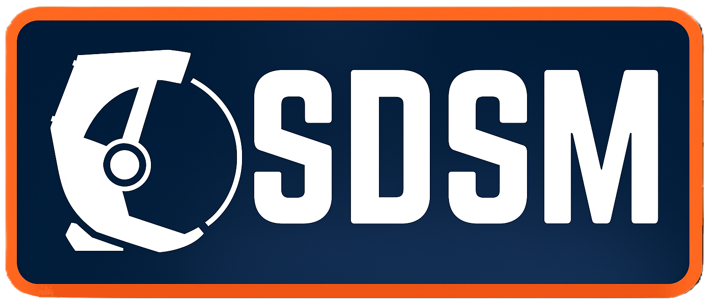
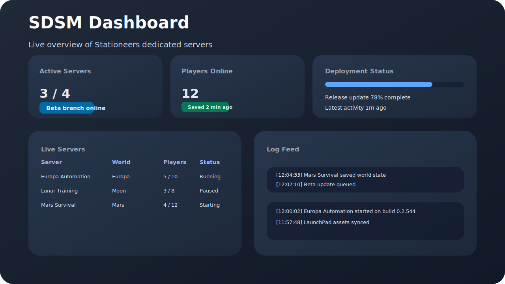
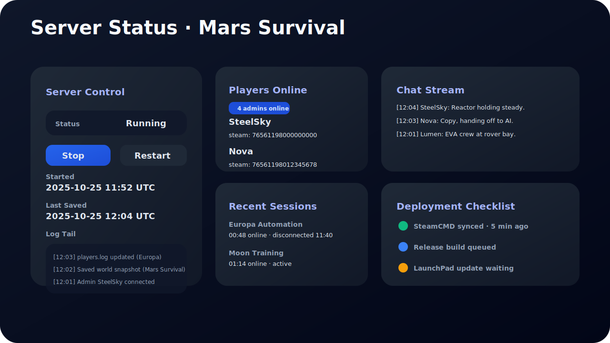

# Stationeers Dedicated Server Manager

[](https://github.com/JonVT/SDSM/actions/workflows/ci.yml)



Modern control plane for running, updating, and monitoring Stationeers dedicated servers. Self-hosted. No telemetry.

—

## Get Started (60 seconds)

You don’t need to install anything else.

1) Download the latest release binary
- Linux: https://github.com/JonVT/SDSM/releases/latest

2) Run it
```bash
chmod +x ./sdsm
./sdsm
```

3) Open the app
- Visit `http://localhost:5000/login` (or `https://` if you enabled TLS)
- First run guides you through setup at `/setup` (or `/admin/setup` to create the first admin).

What happens automatically
- Creates all needed directories under a safe root path (logs, bin, servers, config).
- Downloads and keeps components current: SteamCMD, Stationeers (Release/Beta), BepInEx, LaunchPad, and SCON.
- Syncs per-server files on demand when you create or start a server.

## System Requirements

- OS: Linux x86_64
- CPU: 64‑bit; 2+ cores recommended if running game servers on the same host
- Memory: Sufficient RAM for Stationeers servers you plan to run concurrently
- Disk: 10+ GB free for SteamCMD, Stationeers (Release/Beta), BepInEx, LaunchPad, SCON, and logs
- Network:
	- Outbound internet access for downloads (Steam, GitHub/CDN)
	- Inbound HTTP to the SDSM port (default `5000`) if accessing from another machine
	- Stationeers game port you configure (default `26017`) and SCON port (`GamePort + 1`) reachable as needed
- Permissions: Ability to execute the binary and write to the chosen root path (directories are created on first run)
- TLS (optional): Valid PEM files for `SDSM_TLS_CERT` and `SDSM_TLS_KEY` when `SDSM_USE_TLS=true`
- Browser: Modern Chromium/Firefox-based browser

---

## Overview

SDSM is a Go (Gin) web application that wraps everything you need to operate Stationeers servers on Linux. It supervises deployments, keeps SteamCMD/BepInEx/LaunchPad files current, exposes a clean dashboard for day-to-day operations, and parses log output to surface real-time player, chat, and save activity.

## Feature Highlights

- **Unified dashboard** – Track multiple servers, player counts, deployment progress, and recent log activity.
- **Guided setup + progress** – Setup screen parses `updates.log` to show live component progress and errors.
- **Per-server control** – Start, stop, restart, pause, save; live players/chat/logs with history and admin badges.
- **Centralized command logging** – All SCON command sends (HTTP failures, non-200s) are logged to `sdsm.log` and per-server admin logs.
- **SCON health** – Verify connectivity via `GET /api/servers/:id/scon/health` for quick diagnostics.
- **One-click deployments** – SteamCMD, Release/Beta servers, BepInEx, LaunchPad, SCON, and per-server file sync.
- **Secure access** – Auth, security headers, per-IP rate limiting, optional HTTPS.
- **No telemetry** – SDSM runs locally and does not collect or transmit your data.

## UI Preview

| Dashboard Overview | Server Status Deep Dive |
| --- | --- |
|  |  |

## Architecture At A Glance


- **Client:** HTML templates plus lightweight JavaScript polling keep views up to date without heavy frameworks.
- **Gin layer:** Authentication middleware, template rendering, JSON endpoints, and deployment progress streaming.
- **Manager/models:** Long-running orchestration, filesystem interactions, log parsing, and SteamCMD/BepInEx/LaunchPad deployments.

## Using SDSM

SDSM listens on port `5000` by default. Visit `http://localhost:5000/login` (or `https://` when TLS is enabled).

- Dashboard: overview of servers, players, and deployments.
- Setup: shows live download/install progress parsed from `logs/updates.log`.
- Server pages: start/stop/restart/pause/save, live chat and player lists, historical sessions.
- Health: check SCON connectivity via `GET /api/servers/:id/scon/health` if chat/commands fail.

## Configuration

SDSM persists state to a JSON configuration file. Point the manager at this file using the `SDSM_CONFIG` environment variable or by passing the path as the first CLI argument.

The default root path is derived from the executable directory and contains `bin/*` deployments and a `logs/` directory. Key settings include the Steam app ID (`manager.SteamID`, default `600760`), root path, server inventory, HTTP port (`manager.Port`, default `5000`), and the update schedule (`manager.UpdateTime`).

### Environment Variables

| Variable | Purpose |
| --- | --- |
| `SDSM_CONFIG` | Absolute or relative path to the configuration JSON. |
| `GIN_MODE` | Set to `release` to suppress Gin debug logging. |
| `SDSM_USE_TLS` | Enable HTTPS delivery when set to `true`. |
| `SDSM_TLS_CERT` / `SDSM_TLS_KEY` | PEM files used when TLS is enabled. |
| `SDSM_ALLOW_IFRAME` | Set to `true` to permit same-origin iframe embedding. |

### Sample Launch Commands

```bash
# Plain HTTP
SDSM_CONFIG=/srv/sdsm/sdsm.config ./sdsm

# HTTPS (env-style arguments)
SDSM_USE_TLS=true SDSM_TLS_CERT=/etc/ssl/mycert.pem SDSM_TLS_KEY=/etc/ssl/mykey.pem SDSM_CONFIG=/srv/sdsm/sdsm.config ./sdsm
```

## Operating The Manager

1. Sign in via `/login` and open the Dashboard for servers, players, and deployments.
2. Use Deploy controls (global or per-server) for SteamCMD, Release/Beta, BepInEx, LaunchPad, SCON.
3. Use Server Status to start/stop/restart/pause/save; monitor live players/chat/log; review history.
4. Use Setup to watch live deployment progress parsed from `updates.log`.
5. Probe SCON via `GET /api/servers/:id/scon/health` if chat/commands fail.

---

## Troubleshooting

- UI not reachable:
	- Ensure the binary is running and printing the startup URL (http://localhost:5000).
	- Check firewall rules; allow inbound to port 5000 (or your configured port).
	- Port in use? Change the HTTP port via Settings in the app or edit `port` in `sdsm.config` and restart.

- Setup shows no progress:
	- Open the Setup screen; it reads `logs/updates.log` for real-time progress.
	- Check `logs/updates.log` for the latest line; re-run Deploy from Setup or Manager pages if stuck.

- Chat/commands fail (SCON):
	- Open the server page and try sending a chat message; errors now log to `logs/sdsm.log` and `ServerN/logs/ServerN_admin.log`.
	- Use the SCON health probe (requires login) at `GET /api/servers/:id/scon/health`.
	- Verify SCON files exist under your server’s `BepInEx/plugins` directory; SCON port defaults to `GamePort + 1`.

- Welcome message not sent:
	- Set a non-empty Welcome Message in the server settings.
	- Ensure SCON is reachable (use the health probe); welcome uses `SAY` with a short delay after connect.

- TLS enabled but won’t start:
	- When `SDSM_USE_TLS=true`, both `SDSM_TLS_CERT` and `SDSM_TLS_KEY` must point to readable PEM files.

- SteamCMD or downloads failing:
	- Check network connectivity and try again from the Setup or Manager Deploy controls.
	- Review `logs/updates.log` for component-specific errors (SteamCMD, BepInEx, LaunchPad, SCON).

- Where are logs?
	- Manager: `logs/sdsm.log` and `logs/updates.log`
	- Server: `ServerN/logs/ServerN_admin.log`, `ServerN/logs/ServerN_output.log`, `ServerN/logs/players.log`

- Quick health checks (no auth needed):
	- `GET /healthz` – app up check
	- `GET /version` – build metadata

Tip: If the binary isn’t executable, run `chmod +x ./sdsm` before starting it.

### Firewall Ports

| Port | Direction | Protocol | Purpose |
| --- | --- | --- | --- |
| `5000` | Inbound | TCP | SDSM UI/API (changeable via config) |
| `GamePort` (e.g., `26017`) | Inbound | Typically UDP (open UDP; TCP if needed) | Stationeers gameplay traffic |
| `GamePort + 1` (e.g., `26018`) | Inbound | TCP | SCON HTTP API used by SDSM |

Examples (UFW)
```bash
sudo ufw allow 5000/tcp
sudo ufw allow 26017/udp
sudo ufw allow 26018/tcp
```

Examples (iptables)
```bash
sudo iptables -A INPUT -p tcp --dport 5000 -j ACCEPT
sudo iptables -A INPUT -p udp --dport 26017 -j ACCEPT
sudo iptables -A INPUT -p tcp --dport 26018 -j ACCEPT
```

---

## Run as a systemd Service (optional)

Create a unit file at `/etc/systemd/system/sdsm.service`:

```ini
[Unit]
Description=Stationeers Dedicated Server Manager (SDSM)
After=network.target

[Service]
Type=simple
User=sdsm
Group=sdsm
WorkingDirectory=/srv/sdsm
Environment=SDSM_CONFIG=/srv/sdsm/sdsm.config
# Uncomment to enable HTTPS
# Environment=SDSM_USE_TLS=true
# Environment=SDSM_TLS_CERT=/etc/ssl/certs/sdsm.crt
# Environment=SDSM_TLS_KEY=/etc/ssl/private/sdsm.key
ExecStart=/srv/sdsm/sdsm
Restart=on-failure
RestartSec=5s
NoNewPrivileges=true
ProtectSystem=full
ProtectHome=true
PrivateTmp=true
AmbientCapabilities=

[Install]
WantedBy=multi-user.target
```

Then enable and start it:

```bash
sudo useradd --system --home /srv/sdsm --shell /usr/sbin/nologin sdsm || true
sudo mkdir -p /srv/sdsm
sudo cp ./sdsm /srv/sdsm/sdsm
sudo chown -R sdsm:sdsm /srv/sdsm
sudo chmod +x /srv/sdsm/sdsm
sudo systemctl daemon-reload
sudo systemctl enable --now sdsm.service
sudo systemctl status sdsm.service --no-pager
```

Note: Adjust paths, user/group, and TLS vars for your environment. Logs live under the configured root path; ensure the `sdsm` user can write to it.

## Developers

Build from source
```bash
git clone https://github.com/JonVT/SDSM.git
cd SDSM
go build -o dist/sdsm ./cmd/sdsm
SDSM_CONFIG=/path/to/sdsm.config ./dist/sdsm
```

Formatting, tests, lint
- `gofmt -w ./internal ./cmd`
- `go test ./...`
- `make lint` or `make lint-css`

## Project Layout

```text
cmd/                   # Entrypoint (sdsm)
internal/
	handlers/           # HTTP handlers, HTML rendering, async workflows
	manager/            # Orchestrator, deploy pipeline, config, paths, logging
	middleware/         # Auth, security headers, CORS, rate limiting, websockets
	models/             # Server lifecycle, SCON commands, logs, players/chat
	utils/              # Logger, filesystem paths, process helpers
steam/                # SteamCMD + component updaters (BepInEx, LaunchPad, SCON)
ui/
	static/             # CSS and assets (embedded)
	templates/          # HTML templates (embedded)
webassets/            # Go embed glue for assets
docs/media/           # Diagrams and screenshots
LICENSE               # MIT License
```

## Development

- **Formatting:** `gofmt -w ./internal ./cmd`
- **Build:** `go build -o dist/sdsm ./cmd/sdsm`
- **Tests:** `go test ./...`
- **Logs:** `logs/sdsm.log` and `logs/updates.log` are under the configured root path and are truncated on startup.
- **Player history:** `ServerN/logs/players.log` is deduplicated and rewritten automatically on stop/restart.

### Linting

- Run all linters: `make lint`
- CSS heuristics only: `make lint-css`

The CSS lint checks for obviously unused selectors by scanning HTML templates and JavaScript for class usage (including dynamic `classList.*` and `className` patterns). It’s heuristic by design; review findings before removal.

For UI work, edit the HTML in `ui/templates/` and the styles in `ui/static/`; the JavaScript inside `ui/templates/server_status.html` powers live player/chat/log updates. A shared footer and `/terms` page are included; the footer links to Terms and the GitHub repo.

### SCON Integration

- Commands are sent via the Stationeers SCON HTTP API at `http://localhost:<SCONPort>/command`.
- Default `SCONPort` is the server game port + 1 (e.g., `26017` -> `26018`).
- All send attempts and failures are centrally logged by the model layer.
- Probe reachability via `GET /api/servers/:id/scon/health`.

## Contributing

Issues and pull requests are welcome. Please run `go test ./...` and `go build ./cmd/sdsm` before submitting changes.

### PR Conventions

- Title style: follow Conventional Commits (e.g., `feat: add setup progress timeline`, `fix: handle empty updates.log gracefully`, `chore(ci): run lint on PRs`).
- Labels: use `type/*` (e.g., `type/bug`, `type/feature`, `type/docs`, `type/ci`) and `area/*` (e.g., `area/ui`, `area/templates`, `area/backend`, `area/steam`). A labeler workflow will auto-apply many of these based on changed paths.
- Checklist: ensure build/tests/lint pass; update docs/screenshots if UI changes; prefer small focused PRs.

---

SDSM © JonVT and contributors. Stationeers is © RocketWerkz. This project is not affiliated with or endorsed by RocketWerkz.

## License

This project is licensed under the MIT License. See `LICENSE` for details.

