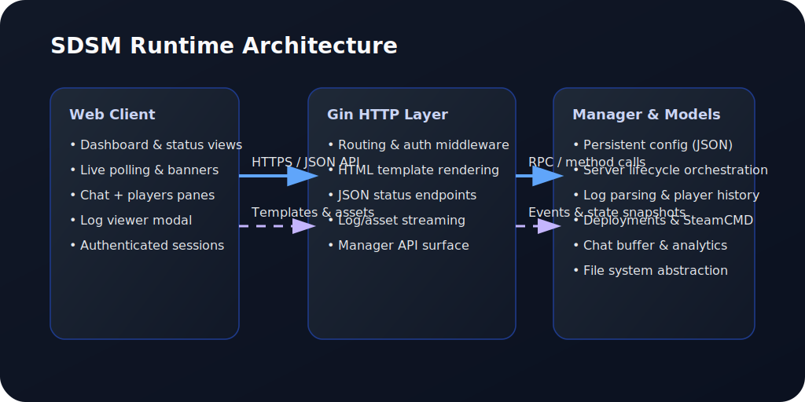

# Stationeers Dedicated Server Manager

[](https://github.com/JonVT/SDSM/actions/workflows/ci.yml)


Modern control plane for running, updating, and monitoring Stationeers dedicated servers. Self-hosted. No telemetry.

—

## Get Started (60 seconds)

You don’t need to install anything else.

1) Download the latest release binary
- Linux: https://github.com/JonVT/SDSM/releases/latest

2) Run it
```bash
chmod +x ./sdsm
./sdsm
```

3) Open the app
- Visit `http://localhost:5000/login`
- First run guides you through setup at `/setup` (or `/admin/setup` to create the first admin).

What happens automatically
- Creates all needed directories under a safe root path (logs, bin, servers, config).
- Downloads and keeps components current: SteamCMD, Stationeers (Release/Beta), BepInEx, LaunchPad, and SCON.
- Syncs per-server files on demand when you create or start a server.

## System Requirements

- OS: Linux x86_64
- CPU: 64‑bit; 2+ cores recommended if running game servers on the same host
- Memory: Sufficient RAM for Stationeers servers you plan to run concurrently
- Disk: 10+ GB free for SteamCMD, Stationeers (Release/Beta), BepInEx, LaunchPad, SCON, and logs
- Network:
	- Outbound internet access for downloads (Steam, GitHub/CDN)
	- Inbound HTTP to the SDSM port (default `5000`) if accessing from another machine
	- Stationeers game port you configure (default `26017`) and SCON port (`GamePort + 1`) reachable as needed
- Permissions: Ability to execute the binary and write to the chosen root path (directories are created on first run)
- TLS (optional): Terminate HTTPS at a reverse proxy (e.g., Nginx, Caddy, Traefik) if you need TLS.
- Browser: Modern Chromium/Firefox-based browser

---

## Overview

SDSM is a Go (Gin) web application that wraps everything you need to operate Stationeers servers on Linux. It supervises deployments, keeps SteamCMD/BepInEx/LaunchPad files current, exposes a clean dashboard for day-to-day operations, and parses log output to surface real-time player, chat, and save activity.

<!-- What's New section intentionally removed until v1.0.0 release -->

## Feature Highlights

- **Unified dashboard** – Track multiple servers, player counts, deployment progress, and recent log activity.
- **Guided setup + progress** – Setup screen parses `updates.log` to show live component progress and errors.
- **Per-server control** – Start, stop, restart, pause, save; live players/chat/logs with history and admin badges.
- **Centralized command logging** – All SCON command sends (HTTP failures, non-200s) are logged to `sdsm.log` and per-server admin logs.
- **SCON health** – Verify connectivity via `GET /api/servers/:id/scon/health` for quick diagnostics.
- **One-click deployments** – SteamCMD, Release/Beta servers, BepInEx, LaunchPad, SCON, and per-server file sync.
- **Secure access** – Auth, security headers, per-IP rate limiting, optional HTTPS.
- **No telemetry** – SDSM runs locally and does not collect or transmit your data.
- **Fast server-to-server navigation** – Header Prev/Next buttons with wraparound and ArrowLeft/ArrowRight shortcuts accelerate multi-server management; tooltips surface target names and shortcuts.

## UI Preview

| Manager | Dashboard | Server Control |
| --- | --- | --- |
|  |  |  |

## Architecture At A Glance



- **Client:** HTML templates plus lightweight JavaScript polling keep views up to date without heavy frameworks.
- **Gin layer:** Authentication middleware, template rendering, JSON endpoints, and deployment progress streaming.
- **Manager/models:** Long-running orchestration, filesystem interactions, log parsing, and SteamCMD/BepInEx/LaunchPad deployments.

## Using SDSM

SDSM listens on port `5000` by default. Visit `http://localhost:5000/login`.

- Dashboard: overview of servers, players, and deployments.
- Setup: shows live download/install progress parsed from `logs/updates.log`.
- Server pages: start/stop/restart/pause/save, live chat and player lists, historical sessions.
- Health: check SCON connectivity via `GET /api/servers/:id/scon/health` if chat/commands fail.

## Configuration

SDSM persists state to a JSON configuration file. Use `--config` (or `-c`) to point to this file. If omitted, SDSM uses `./sdsm.config` in the current working directory and will bootstrap it on first run.

Example launch:

```bash
./sdsm --config /srv/sdsm/sdsm.config
```

Key settings include the root path (where `bin/*`, `logs/`, and per-server directories live), HTTP port (`manager.Port`, default `5000`), Steam app ID (`manager.SteamID`, default `600760`), server inventory, and the update schedule (`manager.UpdateTime`).

Selected config fields:

- `paths.root_path`: Filesystem root for SDSM directories.
- `port`: HTTP port for the UI/API. Default 5000.
- `language`: Default language for world/difficulty extraction. Default `english`.
- `startup_update`: Run selective component updates at startup. Default `true`.
- `detached_servers`: Keep game servers running if SDSM exits. Default `false`.
- `tray_enabled`: Windows tray integration toggle. Default `true` on Windows.
- `tls_enabled`, `tls_cert`, `tls_key`: Optional HTTPS served directly by SDSM (paths may be relative to `root_path`).
- `auto_port_forward_manager`: Attempt UPnP/NAT-PMP port mapping for the manager HTTP(S) port. Default `false`.
- `verbose_http`: More verbose HTTP request logging. Default `false`.
- `verbose_update`: Verbose update-decision logging for components. Default `false`.
- `jwt_secret`: HMAC secret for UI/API sessions. Set this to a strong random string in production.
- `cookie_force_secure`: Force auth cookies to be Secure. Default `false` (automatically Secure under HTTPS).
- `cookie_samesite`: One of `none`, `lax`, `strict`, or `default`. Default `none`.
- `allow_iframe`: Allow embedding in any parent (`frame-ancestors *`). Default `false` (same-origin only).
- `windows_discovery_wmi_enabled`: Windows-only process discovery via WMI. Default `true`.
- `scon_repo_override`: Alternative `owner/repo` for SCON releases.
- `scon_url_linux_override`, `scon_url_windows_override`: Explicit SCON asset URLs per OS.

See also: `docs/sdsm.config.example` for a ready-to-copy minimal config.

### Minimal sdsm.config example

Save this as `sdsm.config` and point SDSM to it with `--config /path/to/sdsm.config`.

```json
{
	"steam_id": "600760",
	"paths": { "root_path": "/srv/sdsm" },
	"port": 5000,
	"language": "english",
	"startup_update": true,
	"detached_servers": false,
	"tray_enabled": false,
	"tls_enabled": false,
	"tls_cert": "",
	"tls_key": "",
	"auto_port_forward_manager": false,
	"verbose_http": false,
	"verbose_update": false,
	"jwt_secret": "change-me-32+chars",
	"cookie_force_secure": false,
	"cookie_samesite": "none",
	"allow_iframe": false,
	"windows_discovery_wmi_enabled": true,
	"scon_repo_override": "",
	"scon_url_linux_override": "",
	"scon_url_windows_override": "",
	"discord_default_webhook": "",
	"discord_bug_report_webhook": "",
	"servers": []
}
```

Tip: On first run, SDSM will create directories under `paths.root_path` and download/update components as needed. Set a strong `jwt_secret` for production.

## Operating The Manager

1. Sign in via `/login` and open the Dashboard for servers, players, and deployments.
2. Use Deploy controls (global or per-server) for SteamCMD, Release/Beta, BepInEx, LaunchPad, SCON.
3. Use Server Status to start/stop/restart/pause/save; monitor live players/chat/log; review history.
4. Use Setup to watch live deployment progress parsed from `updates.log`.
5. Probe SCON via `GET /api/servers/:id/scon/health` if chat/commands fail.

---

## Troubleshooting

- UI not reachable:
	- Ensure the binary is running and printing the startup URL (http://localhost:5000).
	- Check firewall rules; allow inbound to port 5000 (or your configured port).
	- Port in use? Change the HTTP port via Settings in the app or edit `port` in `sdsm.config` and restart.

- Setup shows no progress:
	- Open the Setup screen; it reads `logs/updates.log` for real-time progress.
	- Check `logs/updates.log` for the latest line; re-run Deploy from Setup or Manager pages if stuck.

- Chat/commands fail (SCON):
	- Open the server page and try sending a chat message; errors now log to `logs/sdsm.log` and `ServerN/logs/ServerN_admin.log`.
	- Use the SCON health probe (requires login) at `GET /api/servers/:id/scon/health`.
	- Verify SCON files exist under your server’s `BepInEx/plugins` directory; SCON port defaults to `GamePort + 1`.

- Welcome message not sent:
	- Set a non-empty Welcome Message in the server settings.
	- Ensure SCON is reachable (use the health probe); welcome uses `SAY` with a short delay after connect.

 

- SteamCMD or downloads failing:
	- Check network connectivity and try again from the Setup or Manager Deploy controls.
	- Review `logs/updates.log` for component-specific errors (SteamCMD, BepInEx, LaunchPad, SCON).

- Where are logs?
	- Manager: `logs/sdsm.log` and `logs/updates.log`
	- Server: `ServerN/logs/ServerN_admin.log`, `ServerN/logs/ServerN_output.log`, `ServerN/logs/players.log`

- Quick health checks (no auth needed):
	- `GET /healthz` – liveness (process responding)
	- `GET /readyz` – readiness (200 only when manager active and all required components detected; 503 with JSON list of missing components otherwise)
	- `GET /version` – build metadata

Tip: If the binary isn’t executable, run `chmod +x ./sdsm` before starting it.

### Tray Behavior (Windows vs. Linux)

SDSM includes an optional Windows system tray integration (`TrayEnabled` in config). Behavior:

- Windows: When tray enabled, the app may spawn a detached background instance so the launching console returns immediately, then show a tray icon. Quitting the tray or sending SIGINT/SIGTERM triggers graceful shutdown.
- Non-Windows (Linux/macOS): Tray is automatically disabled; no systray dependencies are required and the process runs normally in foreground/background. Absence of the tray never causes early exit.

The readiness endpoint `/readyz` is unaffected by tray state—it reports readiness based on manager activation and missing component detection.

### Firewall Ports

| Port | Direction | Protocol | Purpose |
| --- | --- | --- | --- |
| `5000` | Inbound | TCP | SDSM UI/API (changeable via config) |
| `GamePort` (e.g., `26017`) | Inbound | Typically UDP (open UDP; TCP if needed) | Stationeers gameplay traffic |
| `GamePort + 1` (e.g., `26018`) | Inbound | TCP | SCON HTTP API used by SDSM |

Examples (UFW)
```bash
sudo ufw allow 5000/tcp
sudo ufw allow 26017/udp
sudo ufw allow 26018/tcp
```

Examples (iptables)
```bash
sudo iptables -A INPUT -p tcp --dport 5000 -j ACCEPT
sudo iptables -A INPUT -p udp --dport 26017 -j ACCEPT
sudo iptables -A INPUT -p tcp --dport 26018 -j ACCEPT
```

---

## TLS via reverse proxy (optional)

SDSM serves plain HTTP on the configured port (default `5000`). If you need HTTPS, terminate TLS at a reverse proxy and forward to SDSM over localhost. Below are minimal examples.

### Nginx

```nginx
server {
		listen 80;
		server_name example.com;
		return 301 https://$host$request_uri;
}

server {
		listen 443 ssl http2;
		server_name example.com;

		ssl_certificate     /etc/letsencrypt/live/example.com/fullchain.pem;
		ssl_certificate_key /etc/letsencrypt/live/example.com/privkey.pem;

		# Proxy to SDSM
		location / {
				proxy_pass http://127.0.0.1:5000;
				proxy_set_header Host $host;
				proxy_set_header X-Real-IP $remote_addr;
				proxy_set_header X-Forwarded-For $proxy_add_x_forwarded_for;
				proxy_set_header X-Forwarded-Proto $scheme;

				# WebSockets (if used)
				proxy_http_version 1.1;
				proxy_set_header Upgrade $http_upgrade;
				proxy_set_header Connection $connection_upgrade;
				map $http_upgrade $connection_upgrade { default upgrade; '' close; }
		}
}
```

### Caddy

```caddyfile
example.com {
		encode zstd gzip
		reverse_proxy 127.0.0.1:5000
}
```

### Traefik (static file + dynamic router)

```yaml
# traefik.yml (static)
entryPoints:
	web:
		address: ":80"
	websecure:
		address: ":443"
providers:
	file:
		filename: /etc/traefik/dynamic.yml
certificatesResolvers:
	letsencrypt:
		acme:
			email: you@example.com
			storage: /letsencrypt/acme.json
			httpChallenge:
				entryPoint: web
```

```yaml
# dynamic.yml
http:
	routers:
		sdsm:
			rule: Host(`example.com`)
			entryPoints: [websecure]
			service: sdsm
			tls:
				certResolver: letsencrypt
		sdsm-redirect:
			rule: Host(`example.com`)
			entryPoints: [web]
			middlewares: [redirect]
			service: noop@internal
	middlewares:
		redirect:
			redirectScheme:
				scheme: https
				permanent: true
	services:
		sdsm:
			loadBalancer:
				servers:
					- url: http://127.0.0.1:5000
```

Notes
- Open port 443/tcp on your firewall when exposing HTTPS.
- Keep SDSM bound to localhost or restrict access at the proxy if exposing to the internet.
- Enable HSTS only after validating HTTPS works across your domain/subdomains.

## Run as a systemd Service (optional)

Create a unit file at `/etc/systemd/system/sdsm.service`:

```ini
[Unit]
Description=Stationeers Dedicated Server Manager (SDSM)
After=network.target

[Service]
Type=simple
User=sdsm
Group=sdsm
WorkingDirectory=/srv/sdsm
ExecStart=/srv/sdsm/sdsm --config /srv/sdsm/sdsm.config
Restart=on-failure
RestartSec=5s
NoNewPrivileges=true
ProtectSystem=full
ProtectHome=true
PrivateTmp=true
AmbientCapabilities=

[Install]
WantedBy=multi-user.target
```

Then enable and start it:

```bash
sudo useradd --system --home /srv/sdsm --shell /usr/sbin/nologin sdsm || true
sudo mkdir -p /srv/sdsm
sudo cp ./sdsm /srv/sdsm/sdsm
sudo chown -R sdsm:sdsm /srv/sdsm
sudo chmod +x /srv/sdsm/sdsm
sudo systemctl daemon-reload
sudo systemctl enable --now sdsm.service
sudo systemctl status sdsm.service --no-pager
```

Note: Adjust paths and user/group for your environment. Logs live under the configured root path; ensure the `sdsm` user can write to it.

## Developers

Build from source
```bash
git clone https://github.com/JonVT/SDSM.git
cd SDSM
go build -o dist/sdsm ./cmd/sdsm
./dist/sdsm --config /path/to/sdsm.config
```

### Architecture Decision Records (ADRs)

We track notable design and operations decisions in ADRs under `docs/adr/`.

- ADR Index: `docs/adr/README.md`
- ADR 0001 — Session Decisions (2025-11-14): `docs/adr/0001-session-decisions-2025-11-14.md`
	- New ADRs: start from `docs/adr/_template.md` and add to the index.

These documents capture conventions like Discord integration, lifecycle notifications, detached server attach-on-restart, Windows/Linux PID liveness checks, SCON-only command delivery, adaptive port forwarding, in-process log parsers, player-save automation, and attach/rehydration knobs.

### Developer Notes: Helper APIs (new)

Cross-cutting concerns are now centralized. Prefer these helpers in handlers:

- Toasts (headers for UI notifications)
	- `ToastSuccess(c, title, msg)`, `ToastInfo`, `ToastWarn`, `ToastError`
	- Under the hood sets `X-Toast-Type`, `X-Toast-Title`, `X-Toast-Message` for HTML/JSON consumers.
- Validation and creation
	- `ValidateServerNameAvailable(mgr, name, excludeID)`
	- `ValidatePortAvailable(mgr, portRaw, excludeID) (port, suggested, error)`
	- `SanitizeWelcome(str, maxLen) string`
	- `ValidateNewServerConfig(mgr, NewServerInput) (*ValidatedServerCreation, error)` to normalize and validate inputs across web and API flows.
	- `DefaultDifficulty(mgr, beta) string` for sensible defaults when unset.
- Realtime updates
	- `BroadcastStatusAndStats(s *models.Server)` replaces ad-hoc paired broadcasts.
- Core start parameter changes and redeploys
	- `ApplyCoreChangeEffects(s, origWorld, origStartLoc, origStartCond, originalBeta)` encapsulates pending save purge flagging and beta redeploy behavior.

UI notes

- Utility-first CSS lives in `ui/static/ui-theme.css` (plus `modern.css`).
- Templates in `ui/templates/` avoid inline styles; HTMX-triggered updates consume toast headers for user feedback.
- Modals: include `{{ template "modal_templates" . }}` and `{{ template "modal_scripts" . }}` on pages that need dialogs.
	- Confirm: `openConfirm({ title:'Delete Server', body:'<p>…</p>', confirmText:'Delete', danger:true })` → Promise<boolean>.
	- Prompt: `openPrompt({ title:'Save As…', label:'Name', validate:(v)=>v?true:'Required' })` → Promise<string|null>.
	- Info: `openInfo({ title:'Help', body: someNodeOrHTML })` → Promise<void>.
	- Helpers auto-handle focus trapping, Escape/backdrop close, and return Promises for clean async flows.

Formatting, tests, lint
- `gofmt -w ./internal ./cmd`
- `go test ./...`
- `make lint` or `make lint-css`

## Project Layout

```text
cmd/                   # Entrypoint (sdsm)
internal/
	handlers/           # HTTP handlers, HTML rendering, async workflows
		toast.go           # Toast header helpers (new)
		validation.go      # Validation + server creation pipeline (new)
		broadcast.go       # Combined status+stats broadcast (new)
		update_helpers.go  # Core change effects + beta redeploy (new)
	manager/            # Orchestrator, deploy pipeline, config, paths, logging
	middleware/         # Auth, security headers, CORS, rate limiting, websockets
	models/             # Server lifecycle, SCON commands, logs, players/chat
	utils/              # Logger, filesystem paths, process helpers
steam/                # SteamCMD + component updaters (BepInEx, LaunchPad, SCON)
ui/
	static/             # CSS and assets (embedded)
	templates/          # HTML templates (embedded)
webassets/            # Go embed glue for assets
docs/media/           # Diagrams and screenshots
LICENSE               # MIT License
```

## Development

- **Formatting:** `gofmt -w ./internal ./cmd`
- **Build:** `go build -o dist/sdsm ./cmd/sdsm`
- **Tests:** `go test ./...`
- **Logs:** `logs/sdsm.log` and `logs/updates.log` are under the configured root path and are truncated on startup.
- **Player history:** `ServerN/logs/players.log` is deduplicated and rewritten automatically on stop/restart.

### Linting

- Run all linters: `make lint`
- CSS heuristics only: `make lint-css`

The CSS lint checks for obviously unused selectors by scanning HTML templates and JavaScript for class usage (including dynamic `classList.*` and `className` patterns). It’s heuristic by design; review findings before removal.

For UI work, edit the HTML in `ui/templates/` and the styles in `ui/static/`. Utility CSS lives in `ui/static/ui-theme.css`; avoid inline styles in templates. The JavaScript inside server status templates powers live player/chat/log updates. A shared footer and `/terms` page are included; the footer links to Terms and the GitHub repo.

### SCON Integration

- Commands are sent via the Stationeers SCON HTTP API at `http://localhost:<SCONPort>/command`.
- Default `SCONPort` is the server game port + 1 (e.g., `26017` -> `26018`).
- All send attempts and failures are centrally logged by the model layer.
- Probe reachability via `GET /api/servers/:id/scon/health`.

## Contributing

Issues and pull requests are welcome. Please run `go test ./...` and `go build ./cmd/sdsm` before submitting changes.

### PR Conventions

- Title style: follow Conventional Commits (e.g., `feat: add setup progress timeline`, `fix: handle empty updates.log gracefully`, `chore(ci): run lint on PRs`).
- Labels: use `type/*` (e.g., `type/bug`, `type/feature`, `type/docs`, `type/ci`) and `area/*` (e.g., `area/ui`, `area/templates`, `area/backend`, `area/steam`). A labeler workflow will auto-apply many of these based on changed paths.
- Checklist: ensure build/tests/lint pass; update docs/screenshots if UI changes; prefer small focused PRs.

---

SDSM © JonVT and contributors. Stationeers is © RocketWerkz. This project is not affiliated with or endorsed by RocketWerkz.

## License

This project is licensed under the MIT License. See `LICENSE` for details.

